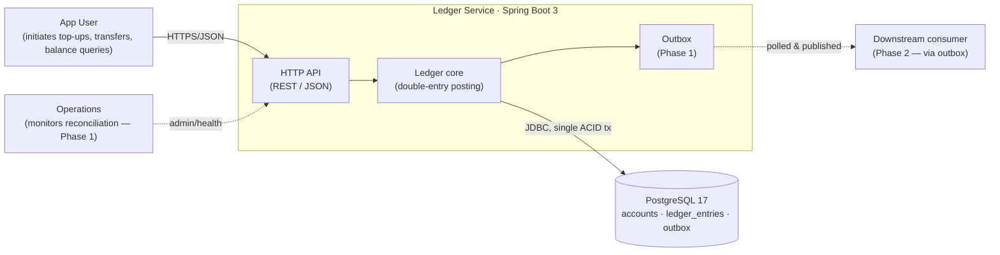

# Architecture: ledger-service

This is the **country map** of the repository — a high-level guide to *where* things
live and *why* the boundaries are drawn where they are. It is not an exhaustive
reference; for the reasoning behind each major choice see `docs/adr/`, and for
per-subsystem deep dives see `docs/architecture/`.

Read this when you are about to make a change and need to know which module owns
the behaviour you are touching.

> **Status**: Phase 0 (skeleton). Feature packages are scaffolded empty; the only
> live code is the smoke endpoint and a permit-all security skeleton. Module
> responsibilities below describe the **intended** Phase 1 shape so the map is
> stable before the code lands. Sections marked _(Phase 1)_ are not implemented yet.

## Overview

`ledger-service` is a mini e-wallet backend: accounts, balances, top-ups,
transfers, and transaction history. It is built on a **double-entry ledger** —
ledger entries are immutable and append-only, and an account's balance is a
projection of those entries kept as a same-transaction cache.

The system is a **modular monolith on a relational database**, deliberately
*not* full event sourcing. It captures the audit-trail and immutability benefits
of an event log for the ledger data without paying the event-sourcing tax
(event versioning, projection rebuilds, ad-hoc-query loss) on the rest of the
domain. See ADR-0001 for the full rationale.

## Big picture

The Phase 0 system context — who talks to the service and what it persists to.
This is a plain flowchart stub; Phase 1 replaces it with a proper C4 Context
diagram in `docs/architecture/`.



## Module map

Application code lives under `src/main/java/com/xidoke/ledger/`, organised
**package-by-feature** (ADR-0004): each package is a bounded context, not a
technical layer. Names below are written out in full so they stay grep-able —
follow the name, not a hyperlink.

|    Package     |                                                    Responsibility                                                    | Phase |
|----------------|----------------------------------------------------------------------------------------------------------------------|-------|
| `account/`     | Account entity, repository, service, controller. Owns balance cache and the `version` column for optimistic locking. | 1     |
| `transfer/`    | Transfer use case — orchestrates a two-leg posting between two accounts.                                             | 1     |
| `topup/`       | Top-up use case — credits an account against the `SYSTEM_FUNDING` counterpart.                                       | 1     |
| `ledger/`      | `LedgerEntry` (append-only), the double-entry posting primitive, and the reconciliation job.                         | 1     |
| `idempotency/` | Idempotency-key storage and the dedup check that guards mutating endpoints.                                          | 1     |
| `outbox/`      | Transactional outbox: event rows written in the posting transaction, polled and published.                           | 1     |
| `common/`      | Cross-cutting only — Spring config, security, web error handling, logging setup.                                     | 0/1   |

Within `common/` today:

- `common/web/` — `HelloController`, the health-style smoke endpoint (`GET /hello`).
- `common/security/` — `SecurityConfig`, a permit-all skeleton; real auth is deferred to Phase 3+.

Schema migrations live in `src/main/resources/db/migration/` as Flyway
`V<n>__description.sql` files (Phase 1 onward).

## Invariants

These are the rules that are hard to infer from any single file. They hold
across the codebase; breaking one is a bug even if the code compiles.

- **`ledger_entries` is append-only.** No `UPDATE`, no `DELETE` on posted
  entries. Corrections are made by writing a new reversing/correcting entry.
  (ADR-0005)
- **Every transaction balances.** A posting writes at least two entries and
  `Σ DEBIT == Σ CREDIT` for the transaction. This is the self-verification
  property the ledger is built on. (ADR-0005)
- **Balance is a cache, never the source of truth.** `accounts.balance` is
  updated in the **same ACID transaction** as the entries it summarises; it can
  always be rebuilt from `ledger_entries`. (ADR-0001, ADR-0006)
- **Money is `BIGINT` minor units, never `float`/`double`.** All amounts are
  integer minor units (e.g. cents) in both Java (`long`) and PostgreSQL
  (`BIGINT`). (ADR-0007)
- **Cross-module access goes through the service layer.** A feature package
  never imports another feature's repository directly — e.g. `transfer/` reads
  account state via `AccountService`, not `AccountRepository`. (ADR-0004)
- **`common/` never imports a feature package.** Dependencies point inward to
  `common/`, never outward. (ADR-0004)

## Data flow

A mutating request (top-up, transfer) follows one path, and the whole write —
ledger entries, balance cache, and outbox row — commits in a single PostgreSQL
transaction:

```
HTTP request
  → controller (feature package, e.g. transfer/)
  → idempotency check (idempotency/) — short-circuits a replay
  → use-case service orchestrates:
        ledger/ posts the double-entry pair
        account/ updates the balance cache (+ version bump)
        outbox/ appends the domain event row
  → single ACID commit  →  PostgreSQL
```

Because the outbox row is written in the same transaction as the ledger entries,
there is no dual-write problem: either everything commits or nothing does. A
separate poller _(Phase 1)_ reads the outbox and publishes downstream.

## Cross-cutting concerns

- **Concurrency** — Optimistic locking via a `version` column on `accounts`;
  conflicting writers retry. Chosen over pessimistic locking to keep hot-account
  contention manageable. (ADR-0011, _Phase 1_)
- **Idempotency** — Mutating endpoints accept an idempotency key; the
  `idempotency/` package records it and short-circuits replays before any
  mutation. _(Phase 1)_
- **Observability** — Structured logging with a propagated correlation ID;
  Actuator health groups under `/actuator/health`. _(Phase 0 wiring → Phase 1 expand)_
- **Error handling** — A global exception handler maps domain exceptions to
  RFC 7807 problem responses. _(Phase 1)_
- **Security** — `common/security/SecurityConfig` is a permit-all skeleton in
  Phase 0; real authentication arrives in Phase 3+.

## Key decisions

The foundational decisions, with the full reasoning in `docs/adr/`:

- [ADR-0001](docs/adr/0001-architectural-style.md) — Modular monolith + double-entry append-only on PostgreSQL, *not* full event sourcing.
- [ADR-0002](docs/adr/0002-language-framework.md) — Java 21 + Spring Boot 3.
- [ADR-0003](docs/adr/0003-database.md) — PostgreSQL.
- [ADR-0004](docs/adr/0004-package-structure.md) — Package-by-feature.
- [ADR-0005](docs/adr/0005-ledger-model.md) — Double-entry, append-only ledger entries.
- [ADR-0006](docs/adr/0006-balance-representation.md) — Balance cached in the same DB transaction as entries.
- [ADR-0007](docs/adr/0007-money-representation.md) — `BIGINT` integer minor units.

See [docs/adr/README.md](docs/adr/README.md) for the full catalog and the
records that land in Phase 1 (ADR-0008 onward).

## Where to look next

- **Make a change** → find the owning package in the [module map](#module-map),
  then read that package's `CLAUDE.md`.
- **Understand a decision** → `docs/adr/`.
- **Subsystem deep dive** (data model, posting flow, outbox flow, concurrency,
  C4 diagrams) → `docs/architecture/` — scaffolded now, filled in Phase 1.
- **Run it locally** → [README.md](README.md) Quickstart.
- **Contribute** → [CONTRIBUTING.md](CONTRIBUTING.md) for branch naming, commit
  format, and the PR process.
