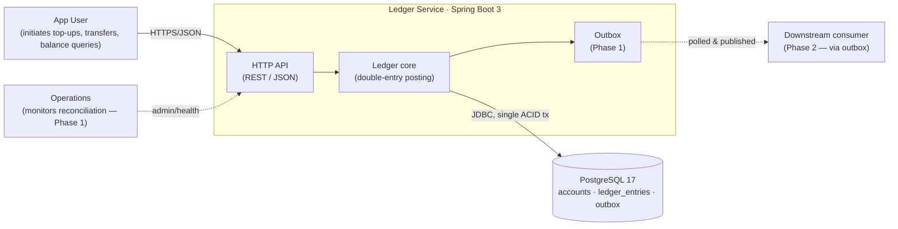

# Architecture: ledger-service

This is the **country map** of the repository — a high-level guide to *where* things
live and *why* the boundaries are drawn where they are. It is not an exhaustive
reference; for the reasoning behind each major choice see `docs/adr/`, and for
per-subsystem deep dives see `docs/architecture/`.

Read this when you are about to make a change and need to know which module owns
the behaviour you are touching.

> **Status**: Phase 1 in progress. The core ledger is live — `account/`, `topup/`,
> `transfer/`, `ledger/`, and `idempotency/` carry real code (double-entry posting,
> balance-cache, top-up + transfer endpoints, the Idempotency-Key filter), all
> structured hexagonally (ADR-0018). Optimistic-lock concurrency with bounded retry is
> now live (M4), the transactional outbox (events committed with the posting + a polling
> poller draining to an idempotent consumer, ADR-0013), and the reconciliation drift job
> (ADR-0016) — so the core ledger (M2–M5) is in place; next is the **v0.1 release** (M6).
> A richer C4 diagram + per-subsystem deep dives are tracked in LDG-59.

## Overview

`ledger-service` is a mini e-wallet backend: accounts, balances, top-ups,
transfers, and transaction history. It is built on a **double-entry ledger** —
ledger entries are immutable and append-only, and an account's balance is a
projection of those entries kept as a same-transaction cache.

The system is a **modular monolith on a relational database**, deliberately
*not* full event sourcing. It captures the audit-trail and immutability benefits
of an event log for the ledger data without paying the event-sourcing tax
(event versioning, projection rebuilds, ad-hoc-query loss) on the rest of the
domain. See ADR-0001 for the full rationale.

## Big picture

The Phase 0 system context — who talks to the service and what it persists to.
This is a plain flowchart stub; Phase 1 replaces it with a proper C4 Context
diagram in `docs/architecture/`.



## Module map

Application code lives under `src/main/java/com/xidoke/ledger/`, organised
**package-by-feature** (ADR-0004): each package is a bounded context, not a
technical layer. Inside each feature it is structured **hexagonally** (ADR-0018):
`domain/` (pure Java — aggregates, value objects, the repository **port**), `adapter/in`
(REST controller), `adapter/out` (JPA/JdbcClient implementation of the port). Names below
are written out in full so they stay grep-able — follow the name, not a hyperlink.

|    Package     |                                                                             Responsibility                                                                             | Status |
|----------------|------------------------------------------------------------------------------------------------------------------------------------------------------------------------|--------|
| `account/`     | `Account` aggregate (balance cache, status, `version`), `debit`/`credit` enforcing ACTIVE + no-overdraw; CRUD endpoints.                                               | live   |
| `topup/`       | Top-up use case — credits a user account against the `SYSTEM_FUNDING` counterpart, one balanced posting.                                                               | live   |
| `transfer/`    | Transfer use case — orchestrates a two-leg `DEBIT from / CREDIT to` posting between two user accounts.                                                                 | live   |
| `ledger/`      | `Transaction` aggregate — the double-entry posting where `Σ DEBIT == Σ CREDIT` is enforced (`post()`). A `@Scheduled` reconciliation job checks cache vs ledger drift. | live   |
| `idempotency/` | `Idempotency-Key` filter + `idempotency_keys` store: claim-first dedup guarding the money endpoints.                                                                   | live   |
| `outbox/`      | Transactional outbox: events written in the posting transaction, drained by a `@Scheduled` poller (log-only at Nấc 0) to an idempotent consumer.                       | live   |
| `common/`      | Cross-cutting + the shared domain kernel — see below.                                                                                                                  | live   |

`LedgerEntry` is **not** in `ledger/`: it is an immutable shared fact in `common/domain`
(shared kernel, ADR-0019), emitted by `Account.debit/credit` and collected by `Transaction`.

Within `common/`:

- `common/domain/` — shared kernel: `Money`, `AccountId`, `TransactionId`, `Direction`, the immutable `LedgerEntry`.
- `common/web/` — `CorrelationIdFilter` (MDC correlation id), `ProblemDetailExceptionHandler` (RFC 7807), `HelloController` smoke endpoint.
- `common/error/` — framework-free base exceptions (`NotFoundException` → 404, `UnprocessableEntityException` → 422) so domain code maps to HTTP without importing Spring.
- `common/security/` — `SecurityConfig`, a permit-all skeleton; real auth is deferred to Phase 3+.

Schema migrations live in `src/main/resources/db/migration/` as Flyway
`V<n>__description.sql` files (V1 baseline → V9 idempotent-consumer inbox so far).

## Invariants

These are the rules that are hard to infer from any single file. They hold
across the codebase; breaking one is a bug even if the code compiles.

- **`ledger_entries` is append-only.** No `UPDATE`, no `DELETE` on posted
  entries. Corrections are made by writing a new reversing/correcting entry.
  (ADR-0005)
- **Every transaction balances.** A posting writes at least two entries and
  `Σ DEBIT == Σ CREDIT` for the transaction. This is the self-verification
  property the ledger is built on. (ADR-0005)
- **Balance is a cache, never the source of truth.** `accounts.balance` is
  updated in the **same ACID transaction** as the entries it summarises; it can
  always be rebuilt from `ledger_entries`. (ADR-0001, ADR-0006)
- **Money is `BIGINT` minor units, never `float`/`double`.** All amounts are
  integer minor units (e.g. cents) in both Java (`long`) and PostgreSQL
  (`BIGINT`). (ADR-0007)
- **Cross-module access goes through the core feature's domain port.** A use-case
  feature reaches a core aggregate only via its public port — e.g. `transfer/` loads
  accounts through the `AccountRepository` port, never another feature's `adapter/out`
  internals. ArchUnit enforces use-case → core (and forbids the reverse). (ADR-0004, ADR-0019)
- **`common/` never imports a feature package.** Dependencies point inward to
  `common/`, never outward. (ADR-0004)

## Data flow

A mutating request (top-up, transfer) follows one path, and the whole write —
ledger entries, balance cache, and outbox row — commits in a single PostgreSQL
transaction:

```
HTTP request
  → IdempotencyFilter (idempotency/) — claims the key up front; replays or 409s a duplicate
  → controller (feature package, e.g. transfer/)
  → use-case service orchestrates, in one @Transactional:
        ledger/  posts the double-entry pair (Transaction.post enforces Σ DEBIT == Σ CREDIT)
        account/ updates the balance cache (+ version bump)
        outbox/  appends the domain event row
  → single ACID commit  →  PostgreSQL
  → OutboxPoller (@Scheduled) later drains PENDING → idempotent consumer → marks SENT
```

The idempotency check runs in a servlet filter *before* the controller (claim-first via
`INSERT … ON CONFLICT`, committed separately so concurrent requests can see it). The
ledger entries + balance cache commit in one ACID transaction (ADR-0006). The outbox row
is written in that same transaction (ADR-0013) so there is no dual-write problem; a
separate `@Scheduled` poller then drains it to an idempotent consumer (log-only at Nấc 0).

## Cross-cutting concerns

- **Idempotency** — The money endpoints (`/transfers`, `/accounts/*/topups`) require an
  `Idempotency-Key`; `IdempotencyFilter` claims it (PENDING row), replays a completed
  duplicate, 409s an in-flight one, and 422s a key reused with a different body. (ADR-0012) ✅
- **Error handling** — `ProblemDetailExceptionHandler` maps domain exceptions to RFC 7807
  responses; status taxonomy 400 / 404 / 409 / 422. ✅
- **Observability** — Structured ECS-JSON logging with a propagated correlation id (MDC);
  Actuator `health`/`info`/`metrics`. (ADR-0017) ✅
- **Concurrency** — Optimistic locking via the `version` column on `accounts` + bounded retry
  (capped backoff + jitter); chosen for the read-heavy profile (reads never block), benchmarked
  vs pessimistic `FOR UPDATE`. (ADR-0011) ✅
- **Security** — `common/security/SecurityConfig` is a permit-all skeleton; real
  authentication arrives in Phase 3+.

## Key decisions

The foundational decisions, with the full reasoning in `docs/adr/`:

- [ADR-0001](docs/adr/0001-architectural-style.md) — Modular monolith + double-entry append-only on PostgreSQL, *not* full event sourcing.
- [ADR-0002](docs/adr/0002-language-framework.md) — Java 21 + Spring Boot 3.
- [ADR-0003](docs/adr/0003-database.md) — PostgreSQL.
- [ADR-0004](docs/adr/0004-package-structure.md) — Package-by-feature.
- [ADR-0005](docs/adr/0005-ledger-model.md) — Double-entry, append-only ledger entries.
- [ADR-0006](docs/adr/0006-balance-representation.md) — Balance cached in the same DB transaction as entries.
- [ADR-0007](docs/adr/0007-money-representation.md) — `BIGINT` integer minor units.
- [ADR-0009](docs/adr/0009-system-funding-account.md) — `SYSTEM_FUNDING` counterpart so top-ups stay balanced.
- [ADR-0010](docs/adr/0010-aggregate-boundary.md) — Account-per-aggregate (the locking boundary).
- [ADR-0011](docs/adr/0011-concurrency-strategy.md) — Optimistic locking + bounded retry (pessimistic benchmarked).
- [ADR-0012](docs/adr/0012-idempotency.md) — `Idempotency-Key` + claim-first in-flight handling.
- [ADR-0013](docs/adr/0013-event-publishing.md) — Transactional outbox (same-tx event write; polling poller).
- [ADR-0014](docs/adr/0014-pii-handling.md) — PII handling: forgettable payload (PII off the append-only log).
- [ADR-0015](docs/adr/0015-event-schema-versioning.md) — Event schema versioning (explicit `schema_version` + tolerant reader).
- [ADR-0016](docs/adr/0016-reconciliation.md) — Periodic reconciliation drift job (cache vs ledger; alert-only).
- [ADR-0017](docs/adr/0017-observability.md) — Structured JSON log + MDC correlation id + Actuator.
- [ADR-0018](docs/adr/0018-hexagonal-architecture.md) — Hexagonal (Ports & Adapters) inside each module.
- [ADR-0019](docs/adr/0019-ddd-tactical-patterns.md) — DDD tactical; `LedgerEntry` as a shared fact.
- [ADR-0031](docs/adr/0031-identifier-strategy.md) — UUID app-generated ids.

See [docs/adr/README.md](docs/adr/README.md) for the full catalog and the records still
pending distillation (0011, 0013–0016).

## Where to look next

- **Make a change** → find the owning package in the [module map](#module-map),
  then read that package's `CLAUDE.md`.
- **Understand a decision** → `docs/adr/`.
- **Subsystem deep dive** (data model, posting flow, outbox flow, concurrency,
  C4 diagrams) → `docs/architecture/` — scaffolded now, filled in Phase 1.
- **Run it locally** → [README.md](README.md) Quickstart.
- **Contribute** → [CONTRIBUTING.md](CONTRIBUTING.md) for branch naming, commit
  format, and the PR process.
