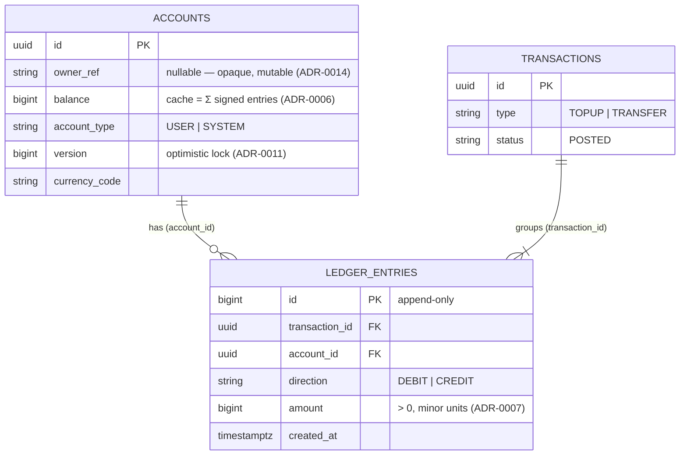

# Data model

How the ledger's core entities relate, and the invariants that bind them. Expands the [country map](../../ARCHITECTURE.md) §Module map.

**Diátaxis**: Explanation. See ADR-0005 (ledger model), ADR-0006 (balance cache), ADR-0007 (money), ADR-0009 (SYSTEM_FUNDING), ADR-0010 (aggregate boundary), ADR-0019 (DDD tactical), ADR-0031 (ids).

## Shape

## Entities

- **`Account`** (`account/domain`) — the aggregate + locking boundary (ADR-0010). Holds the **cached** `balance` (a projection, never the source of truth — ADR-0006), an optimistic-lock `version` (ADR-0011), and `account_type`. `USER` accounts cannot go negative; `SYSTEM_FUNDING` (the single seeded `SYSTEM` account, ADR-0009) may, because its balance mirrors total user holdings.
- **`Transaction`** (`ledger/domain`) — a balanced posting: a group of ≥2 entries whose `Σ DEBIT == Σ CREDIT` (enforced by `Transaction.post()`).
- **`LedgerEntry`** (`common/domain`, the shared kernel — ADR-0019) — an **immutable, append-only** fact: one signed leg on one account. The source of truth. Corrections are new reversing entries, never `UPDATE`/`DELETE` (a DB trigger enforces this, V4).
- **`Money`** (`common/domain`) — integer **minor units** + ISO-4217 currency; never `float` (ADR-0007).

## Invariants

1. **`balance` is a cache** — equals `Σ(CREDIT +amount / DEBIT −amount)` over the account's entries, committed in the *same* transaction (ADR-0006). The reconciliation job re-derives and checks this (ADR-0016).
2. **Every transaction balances** — `Σ DEBIT == Σ CREDIT`; system-wide `Σ all balances == 0`.
3. **`ledger_entries` is append-only** — DB trigger rejects `UPDATE`/`DELETE`; `amount > 0` check.
4. **Ids are app-generated UUIDs** (ADR-0031); `ledger_entries.id` and `outbox.id` are `BIGINT IDENTITY` (monotonic insertion order).
5. **No PII in the append-only tables** — entries/transactions/outbox carry only `account_id`; identity lives on the mutable `accounts.owner_ref` (ADR-0014).
