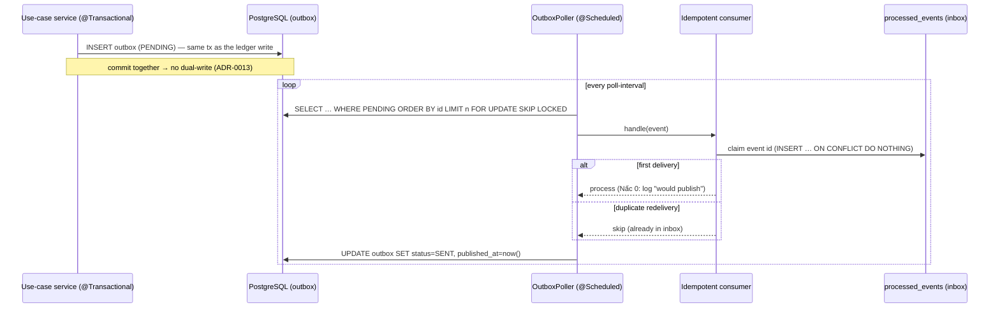

# Outbox flow

How domain events leave the ledger without a dual-write, and how the reconciliation job guards the balance cache. Expands the [country map](../../ARCHITECTURE.md) §Module map (`outbox/`, `ledger/`).

**Diátaxis**: Explanation. See ADR-0013 (transactional outbox), ADR-0015 (event schema versioning), ADR-0016 (reconciliation).

## Write → drain → consume

## Why this shape

- **No dual-write.** Writing the event in the same transaction as the ledger write makes "ledger committed but event lost" and "event sent but ledger rolled back" both impossible (ADR-0013). Proven by a test where a rolled-back posting leaves no outbox row.
- **At-least-once, not exactly-once.** If the poller crashes after publishing but before `markSent`, the row stays PENDING and is redelivered. `FOR UPDATE SKIP LOCKED` lets multiple pollers take disjoint batches; `id BIGINT IDENTITY` gives delivery order.
- **Idempotent consumer.** Because delivery is at-least-once, the consumer dedups by the stable, publisher-assigned `outbox.id` via the `processed_events` inbox (`INSERT … ON CONFLICT DO NOTHING` — an atomic claim, no check-then-act race). So a redelivered event runs its side effect at most once. Nấc 0 logs "would publish"; Phase 2 swaps in a real broker keeping the same dedup-then-act shape.
- **Schema versioning.** Each event carries `schema_version` so the payload can evolve without breaking old consumers (tolerant reader; ADR-0015).

## Reconciliation (the cache safety net)

Separately, a `@Scheduled` `ReconciliationJob` (`ledger/adapter/in`) re-derives each account's balance from the immutable entries and flags drift (`accounts.balance ≠ Σ signed entries`) plus the system-wide trial balance (`Σ debit − Σ credit == 0`). It **alerts, never auto-corrects** — an operator investigates and posts a correcting entry (ADR-0016). This is what keeps the cached balance (ADR-0006) honest over time.
