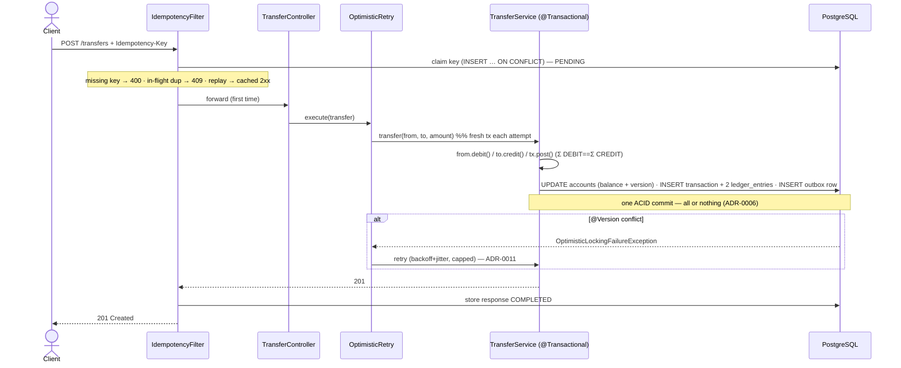

# Posting flow

How a money mutation (top-up, transfer) becomes a balanced double-entry posting in one ACID transaction. Expands the [country map](../../ARCHITECTURE.md) §Data flow.

**Diátaxis**: Explanation. See ADR-0006 (one-tx balance + entries), ADR-0009 (SYSTEM_FUNDING), ADR-0011 (retry), ADR-0012 (idempotency), ADR-0013 (outbox).

## Transfer

## Notes

- **Top-up** is the same shape with one leg pre-set: `DEBIT SYSTEM_FUNDING / CREDIT user` (ADR-0009). `SYSTEM_FUNDING` is the contended row, so its top-ups are the hot path for retry (ADR-0011, [concurrency-model](concurrency-model.md)).
- **Idempotency runs in a servlet filter before the controller** (claim-first, committed separately so a concurrent same-key request sees the PENDING row under `READ COMMITTED`) — ADR-0012. A failed posting releases the key so the client can retry.
- **The outbox row is part of the same transaction** — no dual-write; a rollback leaves neither a ledger entry nor an event ([outbox-flow](outbox-flow.md), ADR-0013).
- **Rejections** roll the whole posting back: insufficient funds / self-transfer / currency mismatch → `422`; not-found → `404`; retry exhaustion → `409` (ADR-0011).
